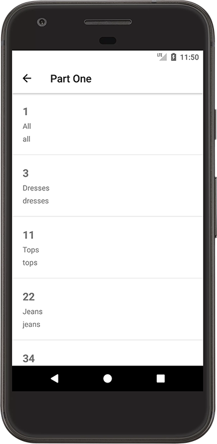
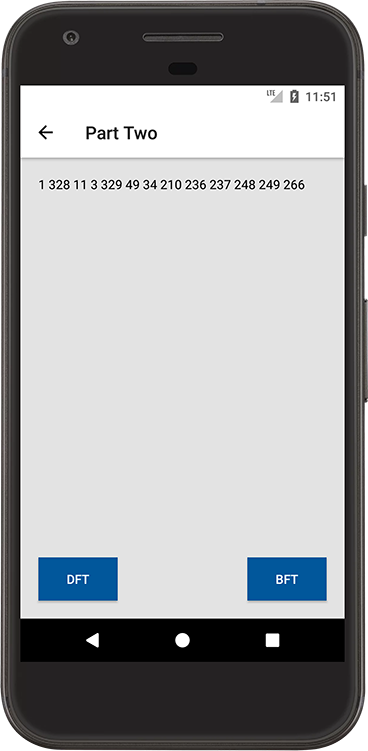
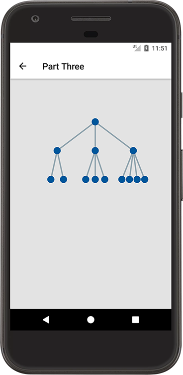
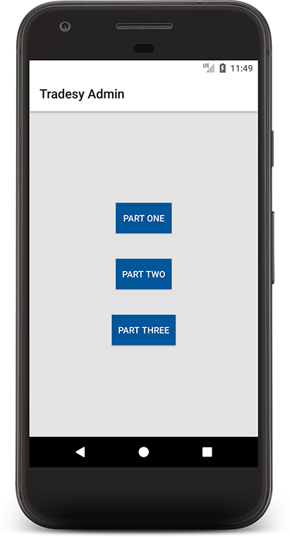

# Android Challenge
**Scenario** You are creating the Admin Android application for Tradesy. There are a few features 
that the product team has in mind. You are free to use any 3rd party libraries, architectures, and 
patterns as you see fit. Finish as many parts as you can. You do not have to write tests.

Thing's to keep in mind (among others):
- Application patterns, architecture, frameworks
- JSON serialization/de-serialization
- Scalability
- Algorithms
- Data Structures
- Java and the JVM
- Caching

## Part 1
**Prompt** You are provided a small subset of product types we sell at Tradesy `product_types.json`.
Display all the product types in a scrollable list. Keep in mind, the actual data sets will be much 
larger. Fill in `FileUtils`'s `getProductTypesArray()` method using the `ProductType` model and 
`product_types.json` file. Present this feature in one activity by completing the `part_one.xml` 
layout.

## Part 2
**Prompt** You are provided a list of relationships `relationships.json`. A relationship consists of 
a parent node ID mapped to its children node IDs. Fill in `FileUtils`'s `getRelationships()` method 
to parse the relationships. Construct a tree by completing the `from()` method in the `Tree`' class.
Then complete the `dft()` and `bft()` methods to generate the Depth-First and Breadth-First 
traversals of the tree respectively. Present this feature in one activty by completing the 
`part_two.xml` layout. Keep in mind, the actual data sets will be much larger. It's okay if the 
output wraps to the next line.

## Part 3
**Prompt** Complete the `TreeView` custom View to represent the product types and their
relationships. Use circles to represent nodes, and lines to represent relationships. Don't worry 
about generating a tree beyond the provided data set (i.e. it's okay if your View isn't built to 
handle deep trees whose nodes have lots of children). Complete the `drawTree()` method. Present this 
feature in an activity using the `part_three_four.xml` layout.

## Bringing it Together
**Prompt** Assign each feature to a button in a main activty with the `activity_main` layout. 
Clicking the button takes the user to that feature. Going back returns the user to the main 
activity.
 
 